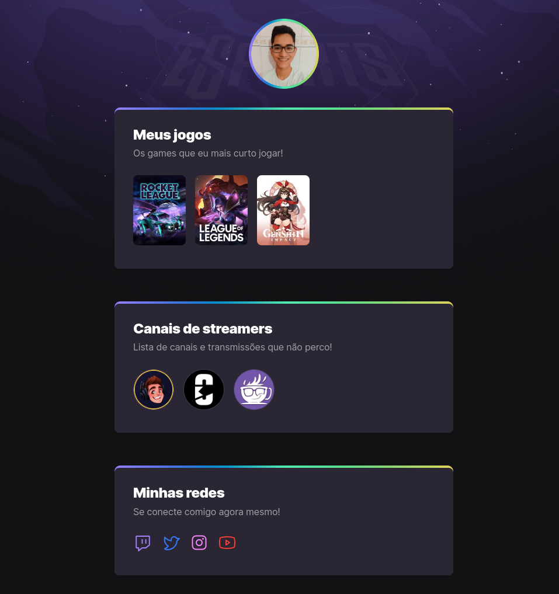

<h1 align="center">NLW eSports</h1>

<h1 align="center">
    
</h1>

>Explorer trail

Project built from the Next Level Week event at the Rocketseat event

🔗 [Click here to access](https://vtkaue.github.io/NLW-eSports-Explorer/)
## :rocket: Technologies ##

The following tools were used in this project:

- HTML 
- CSS
- Git e Github

## 🔖 Layout

You can view the layout of the project via the link below:

- [Layout Web](https://www.figma.com/community/file/1150897317533332617) 

Remembering that you need to have an account on [Figma](http://figma.com/).

## 🤝 Collaborators

We thank the following people who contributed to this project:

<table>
  <tr>
    <td align="center">
      <a href="#">
         
        
          <b>Victor Kauê</b>
        
      </a>
    </td>
  </tr>
</table>